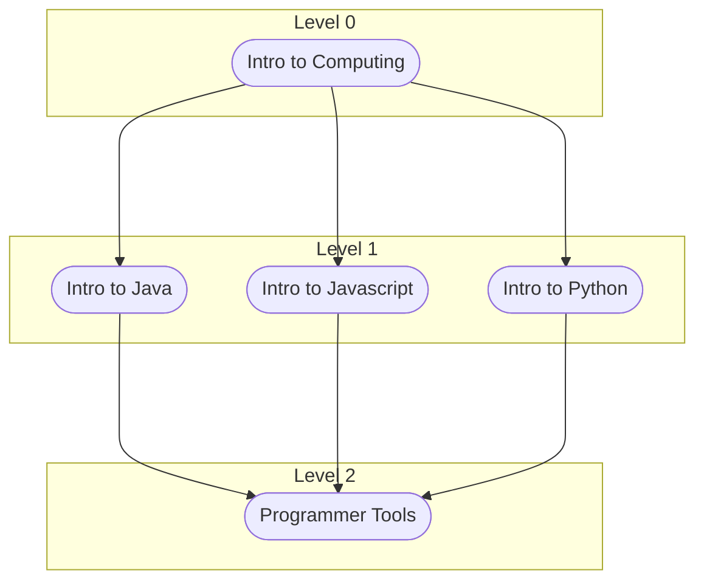

# learn-software
Resources and curriculum for learning software (in general) and for FIRST robotics integrations

# How to use
Each module contains code and examples for learning a specific topic. Each module contains lessons that are 20-30 minutes.
The numbering is only a suggested order to learn using the modules for a beginner. If you already have some experience, feel free to jump around.

You can take many paths in software so this curriculum is no different. It is not intended to be robotics focused but has various courses targetting the knowledge needed for FIRST robotics.

# Need Support?
Student Lead: Jett
Mentor Lead: Jim

If you have a specific topic you would like covered, please let us know and we will add a section.

# Want to contribute?
Check on the CONTRIBUTE.md to learn how to add to this repository.