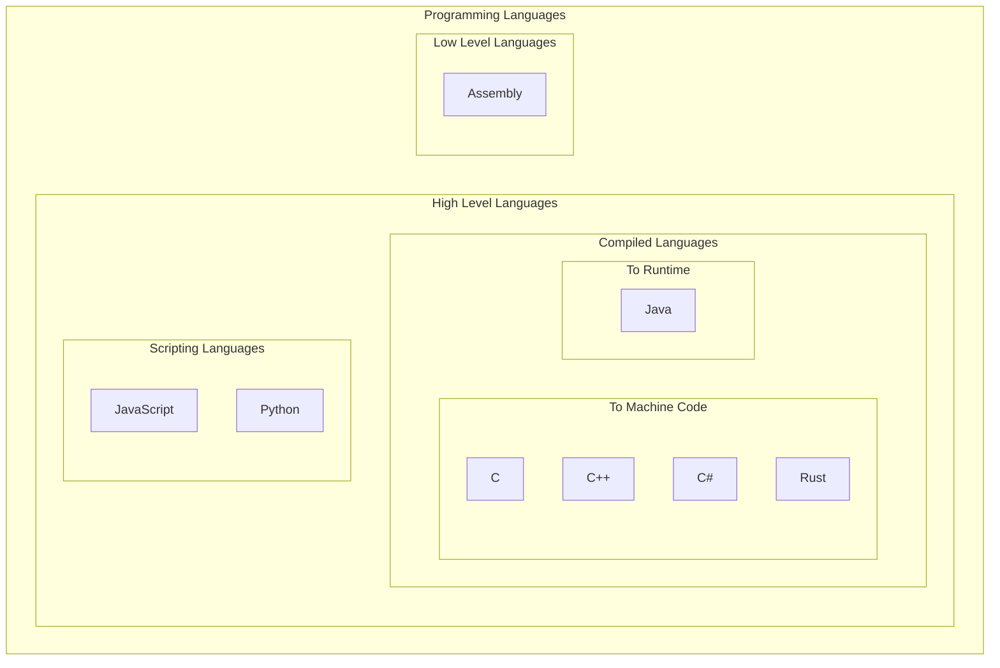

# Programming Languages

Programming languages are languages no different than english or spanish outside of the fact they can be logically compiled down to 1's and 0's and run on a computer. Just like you can say the same thing in english and spanish, so can different programming languages say the same thing, but if a computer doesn't speak your language then it might not work.

Languages are often categorized as low-level or high-level. Low-level are much closer to the 1's and 0's and harder to read, but give you direct access to the hardware. High-level languages are easier to read and provide nice abstractions for organizing your code. In complex programs, organization is an important aspect so that other programmers can understand what the code is trying to do which is why we use high level languages.

## High level languages

There are three types of high level languages.
1. Languages that compile to machine code
1. Languages that compile for a runtime
1. Scripting languages that are read at runtime.

### Languages that compile to machine code
Languages that compile require a build step in order to run. A compiler first reads the human-readable code and converts it to something a computer can run. Some languages compile directly to the 1's and 0's that a specific computer can understand and we call this machine code. It is also often referred to as a binary executable file. Examples of popular languages in this category are C, C++, C# and Rust. In this kind of language you would need to build a separate binary for every type of computer you want to support. A binary built for Mac would not run on Windows.

### Languages the compile for a runtime
A slightly different paradigm exists where instead of compiling code all the way down to machine code, the compiler will compile it to something near machine code that a different program called a `runtime` can understand. Java is the most common example of this kind of language. You first compile human-readabe code to a `.jar` file which the Java runtime can run. In this case, to run a Java program, you must have the Java runtime installed on your computer.

### Scripting languages that are read at runtime
Lastly, there is a style of languages that don't need to be built. A program exists that just reads the code and executes it as it goes. Examples of these are JavaScript and Python. Scripting languages must be read from top down and code only knows about stuff that happens before it. Since these languages don't compile the computer that runs them needs the interpreter program in order to run these. Python's interpreter comes installed on many computers and all web browsers come with an interpreter for Javascript.

# Additional Resources
https://www.codecademy.com/resources/blog/programming-languages/
